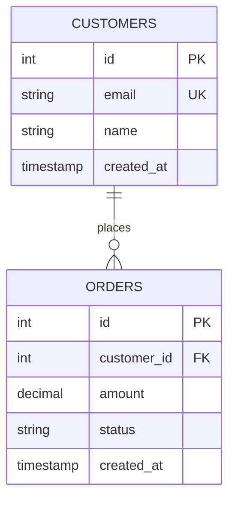

# Deployment Guide: Ghost Architect

Current production setup for running Ghost Architect with Streamlit and the fine-tuned Gemma-3 model.

---

## Overview

**Current Architecture:**
```
Fine-tuned Model (adapter weights)
        ↓
   Streamlit App (src/app.py)
        ↓
Beautiful Mermaid ER Visualization
        ↓
PostgreSQL Schema Output
```

**No GGUF export needed.** The system uses the adapter weights directly for inference.

---

## System Requirements

| Component | Requirement |
|-----------|-------------|
| **RAM** | 16GB minimum (24GB+ recommended) |
| **Disk** | 5GB free (model + cache) |
| **GPU** | Optional but recommended (inference much faster) |
| **Python** | 3.10+ |
| **OS** | Linux, macOS, Windows (WSL2) |

---

## Model Files Location

```
output/
├── adapters/
│   └── trinity_kaggle/              ← PRODUCTION MODEL
│       ├── adapter_model.safetensors  (1.2 GB) — LoRA weights
│       ├── adapter_config.json        — LoRA configuration
│       ├── tokenizer.json             — Tokenizer (33 MB)
│       ├── tokenizer_config.json      — Tokenizer config
│       ├── processor_config.json       — Vision processor config
│       ├── chat_template.jinja         — Message format
│       ├── special_tokens_map.json     — Token definitions
│       └── README.md                   — Model metadata
```

**Default model path in app:** `output/adapters/trinity_kaggle`

---

## Installation & Setup

### 1. Clone/Setup Repository
```bash
cd /home/harshil/ghost_architect_gemma3
```

### 2. Create Virtual Environment
```bash
uv venv .venv
source .venv/bin/activate  # On Windows: .venv\Scripts\activate
```

### 3. Install Dependencies
```bash
uv pip install -r requirements.txt
```

This installs:
- `torch` (PyTorch for inference)
- `transformers` (Hugging Face model loading)
- `peft` (LoRA adapter support)
- `streamlit` (web interface)
- `pillow` (image processing)
- `google-generativeai` (optional, for LLM consolidation)
- All other dependencies

### 4. Verify Installation
```bash
uv run python -c "from peft import AutoPeftModelForCausalLM; print('✓ PEFT loaded')"
uv run python -c "import streamlit; print('✓ Streamlit installed')"
```

---

## Running the App

### Start Streamlit Server
```bash
uv run python -m streamlit run src/app.py
```

The app will:
1. Load the model from `output/adapters/trinity_kaggle/` (first run takes ~60 seconds)
2. Start on `http://localhost:8501`
3. Open your browser automatically

### Configuration

Streamlit settings (optional, in `~/.streamlit/config.toml`):
```toml
[browser]
gatherUsageStats = false

[logger]
level = "info"

[client]
toolbarMode = "minimal"
```

---

## Using the Deployed System

### Web Interface (Streamlit)
```bash
uv run python -m streamlit run src/app.py
```

**Features:**
- Upload up to 10 images
- Real-time inference with progress tracking
- Beautiful Mermaid ER diagrams
- PostgreSQL code generation
- Collapsible source views
- Copy-to-clipboard ready SQL

### CLI Interface (Optional)
```bash
python src/inference.py
```

For quick testing without Streamlit.

---

## Model Loading & Configuration

### Default Behavior
The app loads from `output/adapters/trinity_kaggle/` automatically. No configuration needed.

### Load from Different Adapter
In Streamlit sidebar, change "Adapter path:" to:
- `output/adapters/trinity_gemma4/` (if upgrading to Gemma-4)
- `output/adapters/custom_model/` (for custom fine-tuned versions)

The app will reload the model on next inference.

### Model Details
```python
# What loads internally
from peft import AutoPeftModelForCausalLM
from transformers import AutoTokenizer, AutoProcessor

model = AutoPeftModelForCausalLM.from_pretrained(
    "output/adapters/trinity_kaggle",
    device_map="auto"  # Optimally distributes across GPU/CPU
)
tokenizer = AutoTokenizer.from_pretrained("output/adapters/trinity_kaggle")
processor = AutoProcessor.from_pretrained("output/adapters/trinity_kaggle")
```

---

## Output Format

### Mermaid ER Diagram


Rendered as interactive HTML with:
- Soft blue color scheme (#f8fafc, #eef2ff)
- Card-based table layout
- Relationship arrows with labels
- Collapsible details

### PostgreSQL Output
```sql
CREATE TABLE customers (
    id SERIAL PRIMARY KEY,
    email VARCHAR(255) UNIQUE NOT NULL,
    name VARCHAR(255) NOT NULL,
    created_at TIMESTAMP DEFAULT NOW()
);

CREATE TABLE orders (
    id SERIAL PRIMARY KEY,
    customer_id INT NOT NULL REFERENCES customers(id),
    amount DECIMAL(10, 2),
    status VARCHAR(50),
    created_at TIMESTAMP DEFAULT NOW()
);
```

---

## Performance & Optimization

### First Run (Model Loading)
- **Time:** 60-90 seconds
- **RAM used:** ~8-10 GB
- **Disk I/O:** ~1.5GB read from adapter files

### Subsequent Inference
- **Time per image:** 5-15 seconds
- **Time to consolidate multi-image:** 10-30 seconds
- **RAM resident:** ~8-10 GB (stays loaded)

### Scaling Considerations
- **Single GPU:** Works with 16GB VRAM
- **Multi-image batch:** Processes sequentially; each image is ~15s
- **Concurrent users:** Streamlit handles one user at a time by default

---

## Troubleshooting

### Model Not Found
```
FileNotFoundError: .../trinity_kaggle/adapter_model.safetensors
```

**Fix:** Check that `output/adapters/trinity_kaggle/` exists and contains adapter_model.safetensors
```bash
ls -lh output/adapters/trinity_kaggle/adapter_model.safetensors
```

### CUDA Out of Memory
```
RuntimeError: CUDA out of memory
```

**Fix:**
1. Reduce batch size in app (already set to 1)
2. Restart streamlit to clear GPU cache
3. Close other GPU applications
4. Use CPU-only (slower but works): Set `device_map="cpu"`

### Slow Inference (CPU-only)
Model inference is slow on CPU. Install GPU drivers:
```bash
# For NVIDIA GPU
pip install torch-cuda  # Or appropriate CUDA version

# For AMD GPU
pip install torch-rocm
```

### App Crashes on Startup
Check logs:
```bash
uv run python -m streamlit run src/app.py --logger.level=debug
```

---

## Production Considerations

### Beyond Local Development

**Option 1: Docker Deployment**
```bash
docker build -f docker/Dockerfile -t ghost-architect .
docker run -p 8501:8501 ghost-architect
```

See `docker/` directory for containerization (future setup).

**Option 2: Cloud Deployment**
- **HuggingFace Spaces:** Push model to HF Hub, deploy Streamlit app
- **AWS/Azure:** Deploy on EC2/VM instance with GPU
- **Render/Heroku:** Lightweight deployment (slower, CPU-only)

**Option 3: GGUF Export (Optional)**
If you want to use Ollama for inference:
```bash
python src/export.py  # Exports to output/gguf/ghost-architect-v1.gguf
ollama create ghost-architect -f output/gguf/Modelfile
```

---

## Monitoring & Maintenance

### Health Checks
```bash
# Test model loading
python -c "from peft import AutoPeftModelForCausalLM; model = AutoPeftModelForCausalLM.from_pretrained('output/adapters/trinity_kaggle')"

# Test Streamlit connectivity
curl http://localhost:8501
```

### Logs
```bash
# Streamlit logs (terminal output)
# Check for [ERROR], [WARNING] messages

# Model inference logs
# Usually output by PyTorch to console
```

### Cache Management
```bash
# Clear Streamlit cache
rm -rf ~/.streamlit/

# Clear Python cache
make clean  # or: find . -type d -name __pycache__ -exec rm -r {} +
```

---

## Next Steps

- **Getting started:** See `docs/QUICKSTART.md`
- **Understanding the model:** See `docs/MODEL_TRAINING_SUMMARY.md`
- **System architecture:** See `docs/architecture.md`
- **Learning fine-tuning:** See `docs/learning-guide.md`
